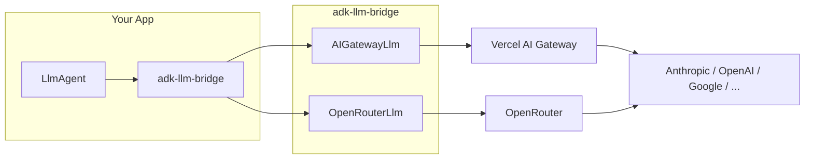

# adk-llm-bridge

[](https://www.npmjs.com/package/adk-llm-bridge)
[](https://opensource.org/licenses/MIT)

Use **any LLM** with [Google ADK TypeScript](https://github.com/google/adk-js) in just a few lines of code.

## Why?

Google ADK TypeScript [only supports Gemini models natively](https://github.com/google/adk-js/blob/main/core/src/models/registry.ts#L113) (unlike the Python version which has LiteLLM integration). This lightweight bridge lets you use **any model** from providers like Anthropic, OpenAI, Meta, and more—while keeping all ADK features like multi-agent orchestration, tool calling, and streaming.

### Key Benefits

| | |
|---|---|
| **Minimal** | ~13KB bundle, single dependency (`openai`) |
| **Simple** | 3 lines to integrate any model |
| **Secure** | No complex dependency tree, just the battle-tested OpenAI SDK |
| **Compatible** | Works with any OpenAI-compatible API (AI Gateway, OpenRouter, etc.) |

## Supported Providers

| Provider | Models | Features |
|----------|--------|----------|
| **[Vercel AI Gateway](https://vercel.com/ai-gateway)** | 100+ models (Claude, GPT-4, Llama, Mistral, etc.) | Simple, fast |
| **[OpenRouter](https://openrouter.ai/)** | 100+ models | Provider routing, fallbacks, price optimization |

## How It Works



The package converts ADK's internal request format to OpenAI-compatible format, sends it through your chosen gateway, and converts the response back to ADK format.

## Installation

```bash
bun add adk-llm-bridge @google/adk
```

```bash
pnpm add adk-llm-bridge @google/adk
```

```bash
npm install adk-llm-bridge @google/adk
```

## Quick Start

Just 3 lines to use Claude, GPT-4, or any model with ADK:

```typescript
import { LlmAgent, LLMRegistry } from '@google/adk';
import { AIGatewayLlm } from 'adk-llm-bridge';  // 1. Import

LLMRegistry.register(AIGatewayLlm);              // 2. Register

const agent = new LlmAgent({                     // 3. Use any model
  name: 'assistant',
  model: 'anthropic/claude-sonnet-4.5',          // Claude, GPT, Llama, etc.
  instruction: 'You are a helpful assistant.',
});
```

That's it. All ADK features work: tools, streaming, multi-agent, etc.

### With OpenRouter

```typescript
import { LlmAgent, LLMRegistry } from '@google/adk';
import { OpenRouterLlm } from 'adk-llm-bridge';

LLMRegistry.register(OpenRouterLlm);

const agent = new LlmAgent({
  name: 'assistant',
  model: 'anthropic/claude-sonnet-4.5',
  instruction: 'You are a helpful assistant.',
});
```

## Configuration

### Environment Variables

**AI Gateway:**
```bash
AI_GATEWAY_API_KEY=your-api-key
AI_GATEWAY_URL=https://ai-gateway.vercel.sh/v1  # optional
```

**OpenRouter:**
```bash
OPENROUTER_API_KEY=your-api-key
OPENROUTER_SITE_URL=https://your-site.com  # optional, for ranking
OPENROUTER_APP_NAME=Your App Name          # optional, for ranking
```

### Programmatic Configuration

```typescript
import { registerAIGateway, registerOpenRouter } from 'adk-llm-bridge';

// AI Gateway
registerAIGateway({
  apiKey: process.env.MY_API_KEY,
  baseURL: 'https://my-gateway.example.com/v1',
});

// OpenRouter
registerOpenRouter({
  apiKey: process.env.OPENROUTER_API_KEY,
  siteUrl: 'https://your-site.com',
  appName: 'Your App',
});
```

### Factory Functions (Per-Agent Config)

```typescript
import { LlmAgent } from '@google/adk';
import { AIGateway, OpenRouter } from 'adk-llm-bridge';

// AI Gateway
const agent1 = new LlmAgent({
  name: 'assistant',
  model: AIGateway('anthropic/claude-sonnet-4.5', { timeout: 30000 }),
  instruction: 'You are helpful.',
});

// OpenRouter with provider routing
const agent2 = new LlmAgent({
  name: 'fast-assistant',
  model: OpenRouter('anthropic/claude-sonnet-4.5', {
    provider: {
      sort: 'latency',
      allow_fallbacks: true,
    },
  }),
  instruction: 'You are helpful.',
});
```

## OpenRouter Features

OpenRouter provides additional features not available in AI Gateway:

```typescript
import { OpenRouter } from 'adk-llm-bridge';

const llm = OpenRouter('anthropic/claude-sonnet-4.5', {
  // Ranking headers (improves your rate limits)
  siteUrl: 'https://your-site.com',
  appName: 'Your App',
  
  // Provider routing
  provider: {
    order: ['Anthropic', 'Google'],  // Prefer specific providers
    sort: 'latency',                  // or 'price', 'throughput'
    allow_fallbacks: true,            // Fallback if primary fails
    data_collection: 'deny',          // Opt-out of data collection
  },
});
```

## Model Format

Use the `provider/model` format:

```
anthropic/claude-opus-4.5
openai/gpt-5.2-pro
google/gemini-3-pro
meta/llama-3.3-70b-instruct
mistral/mistral-large-3
xai/grok-4.1
deepseek/deepseek-r1
```

### Popular Models

| Provider | Models |
|----------|--------|
| Anthropic | `anthropic/claude-sonnet-4.5`, `anthropic/claude-opus-4.5` |
| OpenAI | `openai/gpt-5.2-pro`, `openai/gpt-4.1`, `openai/o3-mini` |
| Google | `google/gemini-3-pro`, `google/gemini-3-flash`, `google/gemini-2.5-pro` |
| Meta | `meta/llama-3.3-70b-instruct`, `meta/llama-3.1-405b-instruct` |
| Mistral | `mistral/mistral-large-3`, `mistral/mistral-large-2411` |
| xAI | `xai/grok-4.1`, `xai/grok-4-fast`, `xai/grok-3` |
| DeepSeek | `deepseek/deepseek-v3.2`, `deepseek/deepseek-r1` |

Browse all models:
- [Vercel AI Gateway Models](https://vercel.com/ai-gateway/models)
- [OpenRouter Models](https://openrouter.ai/models)

## Features

- **Text generation** - Simple prompt/response
- **Streaming** - Real-time token streaming
- **Tool calling** - Function calling with automatic conversion
- **Multi-turn** - Full conversation history support
- **Multi-agent** - Sub-agents and agent transfer
- **Usage metadata** - Token counts for monitoring

## Tool Calling Example

```typescript
import { FunctionTool, LlmAgent, LLMRegistry } from '@google/adk';
import { AIGatewayLlm } from 'adk-llm-bridge';
import { z } from 'zod';

LLMRegistry.register(AIGatewayLlm);

const getWeather = new FunctionTool({
  name: 'get_weather',
  description: 'Get current weather for a city',
  parameters: z.object({
    city: z.string().describe('City name'),
  }),
  execute: ({ city }) => {
    return { status: 'success', weather: 'sunny', city };
  },
});

const agent = new LlmAgent({
  name: 'weather-assistant',
  model: 'anthropic/claude-sonnet-4.5',
  instruction: 'You help users check the weather.',
  tools: [getWeather],
});
```

## Using with adk-devtools

When using `adk-devtools`, import `LLMRegistry` from `@google/adk` directly:

```typescript
import { LlmAgent, LLMRegistry } from '@google/adk';
import { AIGatewayLlm, OpenRouterLlm } from 'adk-llm-bridge';

// Register the provider you want to use
LLMRegistry.register(AIGatewayLlm);
// or
LLMRegistry.register(OpenRouterLlm);

export const rootAgent = new LlmAgent({
  name: 'assistant',
  model: 'anthropic/claude-sonnet-4.5',
  instruction: 'You are helpful.',
});
```

Then run:
```bash
bunx @google/adk-devtools web
```

## API Reference

### Classes

| Class | Description |
|-------|-------------|
| `AIGatewayLlm` | LLM class for Vercel AI Gateway |
| `OpenRouterLlm` | LLM class for OpenRouter |

### Factory Functions

| Function | Description |
|----------|-------------|
| `AIGateway(model, options?)` | Create AI Gateway LLM instance |
| `OpenRouter(model, options?)` | Create OpenRouter LLM instance |

### Registration Functions

| Function | Description |
|----------|-------------|
| `registerAIGateway(options?)` | Register AIGatewayLlm with LLMRegistry |
| `registerOpenRouter(options?)` | Register OpenRouterLlm with LLMRegistry |

### Configuration Options

**AIGateway / AIGatewayLlm:**

| Option | Type | Default | Description |
|--------|------|---------|-------------|
| `apiKey` | `string` | `process.env.AI_GATEWAY_API_KEY` | API key |
| `baseURL` | `string` | `https://ai-gateway.vercel.sh/v1` | Gateway URL |
| `timeout` | `number` | `60000` | Request timeout (ms) |
| `maxRetries` | `number` | `2` | Max retry attempts |

**OpenRouter / OpenRouterLlm:**

| Option | Type | Default | Description |
|--------|------|---------|-------------|
| `apiKey` | `string` | `process.env.OPENROUTER_API_KEY` | API key |
| `baseURL` | `string` | `https://openrouter.ai/api/v1` | API URL |
| `siteUrl` | `string` | `process.env.OPENROUTER_SITE_URL` | Your site URL (for ranking) |
| `appName` | `string` | `process.env.OPENROUTER_APP_NAME` | Your app name (for ranking) |
| `provider` | `object` | - | Provider routing preferences |
| `timeout` | `number` | `60000` | Request timeout (ms) |
| `maxRetries` | `number` | `2` | Max retry attempts |

## Examples

See the [examples](./examples) directory:

- **[basic-agent-ai-gateway](./examples/basic-agent-ai-gateway)** - Multi-agent HelpDesk with AI Gateway
- **[basic-agent-openrouter](./examples/basic-agent-openrouter)** - Multi-agent HelpDesk with OpenRouter
- **[express-server](./examples/express-server)** - Production HTTP API with sessions, streaming, tools

## Requirements

- Node.js >= 18.0.0
- `@google/adk` >= 0.2.0

## Contributing

See [CONTRIBUTING.md](CONTRIBUTING.md) for development setup and guidelines.

## License

[MIT](LICENSE)
