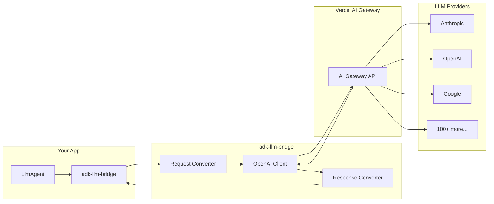
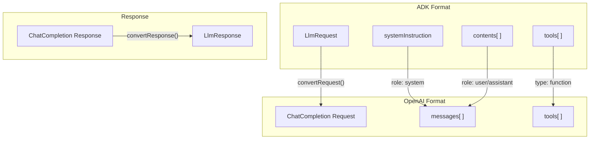

# adk-llm-bridge

[](https://www.npmjs.com/package/adk-llm-bridge)
[](https://opensource.org/licenses/MIT)

Connect [Google ADK](https://google.github.io/adk-docs/) to [Vercel AI Gateway](https://vercel.com/ai-gateway) and 100+ LLM models.

## Why?

[Google ADK TypeScript](https://github.com/google/adk-js) only supports Gemini models natively (unlike the Python version which has LiteLLM integration). This package bridges that gap, letting you use **any model** from Vercel AI Gateway (Claude, GPT-4, Llama, Mistral, etc.) while keeping all ADK features like multi-agent orchestration, tool calling, and streaming.

## How It Works



The package converts ADK's internal request format to OpenAI-compatible format, sends it through Vercel AI Gateway, and converts the response back to ADK format.

### Data Conversion



## Installation

```bash
bun add adk-llm-bridge @google/adk
```

```bash
pnpm add adk-llm-bridge @google/adk
```

```bash
npm install adk-llm-bridge @google/adk
```

## Quick Start

```typescript
import { LlmAgent, LLMRegistry, Runner, InMemorySessionService } from '@google/adk';
import { AIGatewayLlm } from 'adk-llm-bridge';

// Register once at startup
LLMRegistry.register(AIGatewayLlm);

const agent = new LlmAgent({
  name: 'assistant',
  model: 'anthropic/claude-sonnet-4', // String model name
  instruction: 'You are a helpful assistant.',
});

// Run with Runner (programmatic usage)
const sessionService = new InMemorySessionService();
const runner = new Runner({ agent, appName: 'my-app', sessionService });

const session = await sessionService.createSession({ appName: 'my-app', userId: 'user-1' });

for await (const event of runner.runAsync({
  userId: 'user-1',
  sessionId: session.id,
  newMessage: { role: 'user', parts: [{ text: 'Hello!' }] },
})) {
  console.log(event);
}
```

## Configuration

### Environment Variables (Recommended)

```bash
AI_GATEWAY_API_KEY=your-api-key
AI_GATEWAY_URL=https://ai-gateway.vercel.sh/v1  # optional
```

### Global Configuration

Configure defaults when registering:

```typescript
import { LlmAgent, LLMRegistry } from '@google/adk';
import { AIGatewayLlm, registerAIGateway } from 'adk-llm-bridge';

// Option 1: Register with defaults from env vars
LLMRegistry.register(AIGatewayLlm);

// Option 2: Register with custom config
registerAIGateway({
  apiKey: process.env.MY_API_KEY,
  baseURL: 'https://my-gateway.example.com/v1',
});

const agent = new LlmAgent({
  name: 'assistant',
  model: 'anthropic/claude-sonnet-4',
  instruction: 'You are helpful.',
});
```

### Using with adk-devtools

Works out of the box with `adk-devtools` (CLI or web interface):

```typescript
import { LlmAgent, LLMRegistry } from '@google/adk';
import { AIGatewayLlm } from 'adk-llm-bridge';

LLMRegistry.register(AIGatewayLlm);

export const rootAgent = new LlmAgent({
  name: 'assistant',
  model: 'anthropic/claude-sonnet-4',
  instruction: 'You are helpful.',
});
```

Then run:
```bash
bunx @google/adk-devtools dev agent.ts
```

## Model Format

Use the `provider/model` format:

```
anthropic/claude-sonnet-4
openai/gpt-4o
google/gemini-2.0-flash
xai/grok-2
deepseek/deepseek-chat
zai/glm-4.6
```

**Any model available in [Vercel AI Gateway](https://vercel.com/ai-gateway/models) will work.**

### Popular Providers

| Provider | Examples |
|----------|----------|
| Anthropic | `anthropic/claude-opus-4`, `anthropic/claude-sonnet-4` |
| OpenAI | `openai/gpt-4.1`, `openai/o3`, `openai/gpt-4o` |
| Google | `google/gemini-2.5-pro`, `google/gemini-2.5-flash` |
| Meta | `meta/llama-4-scout`, `meta/llama-4-maverick` |
| Mistral | `mistral/mistral-large-2411`, `mistral/pixtral-large` |
| xAI | `xai/grok-3`, `xai/grok-3-mini` |
| DeepSeek | `deepseek/deepseek-v3`, `deepseek/deepseek-r1` |
| Groq | `groq/llama-3.3-70b` |
| Perplexity | `perplexity/sonar-pro` |

Browse all available models at [Vercel AI Gateway Models](https://vercel.com/ai-gateway/models).

## Features

- **Text generation** - Simple prompt/response
- **Streaming** - Real-time token streaming
- **Tool calling** - Function calling with automatic conversion
- **Multi-turn** - Full conversation history support
- **Usage metadata** - Token counts for monitoring

## Tool Calling Example

```typescript
import { FunctionTool, LlmAgent, LLMRegistry } from '@google/adk';
import { AIGatewayLlm } from 'adk-llm-bridge';
import { z } from 'zod';

LLMRegistry.register(AIGatewayLlm);

const getWeather = new FunctionTool({
  name: 'get_weather',
  description: 'Get current weather for a city',
  parameters: z.object({
    city: z.string().describe('City name'),
  }),
  execute: ({ city }) => {
    return { status: 'success', weather: 'sunny', city };
  },
});

const agent = new LlmAgent({
  name: 'weather-assistant',
  model: 'anthropic/claude-sonnet-4',
  instruction: 'You help users check the weather.',
  tools: [getWeather],
});
```

## Production Usage (HTTP API Server)

See [examples/express-server](./examples/express-server) for a complete example with:
- Session management with state persistence
- Artifact storage
- Memory service
- FunctionTool with ToolContext
- Token-level streaming (SSE)

```typescript
import express from "express";
import { LlmAgent, LLMRegistry, Runner, InMemorySessionService } from "@google/adk";
import { AIGatewayLlm } from "adk-llm-bridge";

LLMRegistry.register(AIGatewayLlm);

const agent = new LlmAgent({
  name: "assistant",
  model: "anthropic/claude-sonnet-4",
  instruction: "You are a helpful assistant.",
});

const sessionService = new InMemorySessionService();
const runner = new Runner({ agent, appName: "my-app", sessionService });

const app = express();
app.use(express.json());

app.post("/run", async (req, res) => {
  const { userId, sessionId, message } = req.body;
  
  let session = sessionId 
    ? await sessionService.getSession({ appName: "my-app", userId, sessionId }).catch(() => null)
    : null;
  
  if (!session) {
    session = await sessionService.createSession({ appName: "my-app", userId });
  }

  const events = [];
  for await (const event of runner.runAsync({
    userId,
    sessionId: session.id,
    newMessage: { role: "user", parts: [{ text: message }] },
  })) {
    events.push(event);
  }

  res.json({ sessionId: session.id, events });
});

app.listen(3000);
```

## API Reference

### `AIGatewayLlm`

The main LLM class for use with `LLMRegistry`:

```typescript
import { LLMRegistry } from '@google/adk';
import { AIGatewayLlm } from 'adk-llm-bridge';

LLMRegistry.register(AIGatewayLlm);
```

### `registerAIGateway(options?)`

Helper to register with custom configuration:

```typescript
import { registerAIGateway } from 'adk-llm-bridge';

registerAIGateway({ apiKey: 'sk-...' });
```

### `AIGateway(model, options?)`

Creates an LLM instance directly for per-agent configuration:

```typescript
import { LlmAgent } from '@google/adk';
import { AIGateway } from 'adk-llm-bridge';

const agent = new LlmAgent({
  name: 'assistant',
  model: AIGateway('anthropic/claude-sonnet-4'),
  instruction: 'You are helpful.',
});

// With custom options per agent
const customAgent = new LlmAgent({
  name: 'custom',
  model: AIGateway('openai/gpt-4o', { apiKey: 'sk-...', timeout: 30000 }),
  instruction: 'You are helpful.',
});
```

| Parameter | Type | Description |
|-----------|------|-------------|
| `model` | `string` | Model identifier (e.g., `anthropic/claude-sonnet-4`) |
| `options.apiKey` | `string` | API key (default: `process.env.AI_GATEWAY_API_KEY`) |
| `options.baseURL` | `string` | Gateway URL (default: `https://ai-gateway.vercel.sh/v1`) |
| `options.timeout` | `number` | Request timeout in ms (default: `60000`) |
| `options.maxRetries` | `number` | Max retry attempts (default: `2`) |

## Requirements

- Node.js >= 18.0.0
- `@google/adk` >= 0.2.0

## Contributing

See [CONTRIBUTING.md](CONTRIBUTING.md) for development setup and guidelines.

## License

[MIT](LICENSE)
