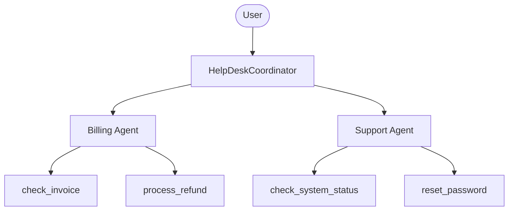

# Basic Agent with OpenRouter

A multi-agent HelpDesk system using [OpenRouter](https://openrouter.ai/) as the LLM provider.

## Architecture



## Setup

1. Copy the environment file and add your OpenRouter API key:
   ```bash
   cp .env.example .env
   # Edit .env and add your OPENROUTER_API_KEY
   ```

2. Install dependencies:
   ```bash
   bun install
   ```

3. Run the agent with DevTools:
   ```bash
   bun run web
   ```

## OpenRouter Features

This example uses OpenRouter which provides:

- **100+ models** from various providers (OpenAI, Anthropic, Google, Meta, etc.)
- **Automatic fallbacks** when a provider is unavailable
- **Provider routing** - choose by price, latency, or throughput
- **Ranking headers** - `HTTP-Referer` and `X-Title` for better rates

### Provider Routing Options

You can configure provider preferences programmatically:

```typescript
import { OpenRouter } from "adk-llm-bridge";

const llm = OpenRouter("anthropic/claude-sonnet-4", {
  provider: {
    sort: "latency",        // or "price", "throughput"
    allow_fallbacks: true,
    order: ["Anthropic"],   // prefer specific providers
  },
});
```

## Example Questions

### Billing Agent
- "Can you check the status of invoice INV-001?"
- "I need to request a refund for invoice INV-002"
- "What invoices do I have for user@example.com?"

### Support Agent
- "What's the current status of the auth service?"
- "I need to reset my password for user@example.com"
- "Is the API experiencing any issues?"

### Coordinator
- "I have a billing question about my subscription"
- "I can't log into my account"
