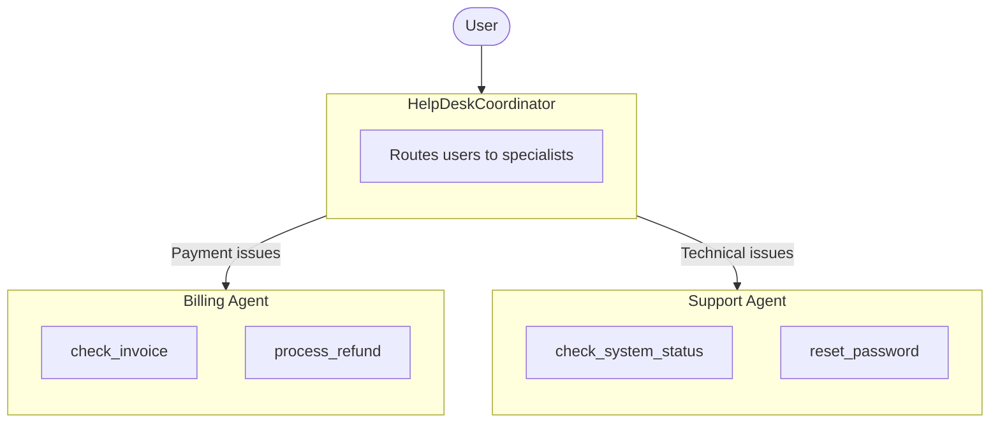

# HelpDesk Multi-Agent Example

This example demonstrates a multi-agent system using [adk-llm-bridge](https://www.npmjs.com/package/adk-llm-bridge) with Google ADK.

## Architecture



## Setup

```bash
cd examples/basic-agent
bun install
```

Create a `.env` file:

```env
AI_GATEWAY_API_KEY=your-api-key
# Or use provider-specific keys:
# ANTHROPIC_API_KEY=your-key
# OPENAI_API_KEY=your-key
```

## Run

```bash
# Start the DevTools web UI
bun run web

# Or run in CLI mode
bun run dev
```

## Example Questions

### Billing Agent

Ask these to be routed to the Billing specialist:

**Invoice Lookup (by ID):**
```
"Can you check invoice INV-001?"
"What's the status of invoice INV-002?"
```
> Returns: Invoice details with amount ($99.00), status, date, and description

**Invoice Lookup (by Email):**
```
"Show me all invoices for john@example.com"
"What invoices are pending for customer@test.com?"
```
> Returns: List of invoices (INV-001 paid, INV-002 pending)

**Process Refund:**
```
"I need a refund for invoice INV-001, I was charged twice"
"Please refund INV-002, the service didn't work"
```
> Returns: Refund ID (REF-xxx) with confirmation message

### Support Agent

Ask these to be routed to the Support specialist:

**System Status (all services):**
```
"Is the system down?"
"Check if all services are working"
```
> Returns: Status of api (operational), web (operational), database (operational), auth (degraded)

**System Status (specific service):**
```
"Is the API working?"
"Check the auth service status"
"Why is login slow?"
```
> Returns: Service status - Note: auth service shows "degraded" with "Investigating slowness"

**Password Reset:**
```
"I forgot my password, my email is user@example.com"
"Reset password for john@company.com"
```
> Returns: Confirmation that reset link was sent (expires in 1 hour)

### Coordinator (General)

Ask these to see the routing in action:

```
"Hello, I need help"
"My payment failed"          → Routes to Billing
"I can't log in"             → Routes to Support
"I have invoice questions"   → Routes to Billing
"The website is slow"        → Routes to Support
```

## How It Works

1. **User sends a message** to the HelpDeskCoordinator
2. **Coordinator analyzes** the request and determines the appropriate specialist
3. **Agent transfer** occurs via ADK's `transfer_to_agent` function call
4. **Specialist handles** the request using their specific tools
5. **Response** is returned to the user

## Tools Available

### Billing Agent Tools

| Tool | Description |
|------|-------------|
| `check_invoice` | Look up invoice by ID or customer email |
| `process_refund` | Process refund for a specific invoice |

### Support Agent Tools

| Tool | Description |
|------|-------------|
| `check_system_status` | Check status of api, web, database, auth services |
| `reset_password` | Send password reset link to user's email |

## Customization

You can easily modify the agents to use different models:

```typescript
const billingAgent = new LlmAgent({
  name: "Billing",
  model: "openai/gpt-4o",  // Use OpenAI instead
  // ...
});
```

Supported model formats: `provider/model-name` (e.g., `anthropic/claude-sonnet-4`, `openai/gpt-4o`, `google/gemini-2.0-flash`)
